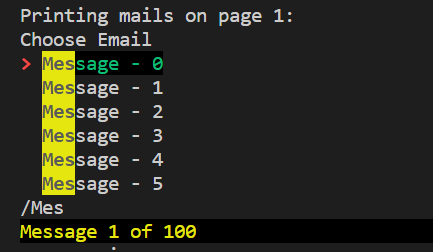

<h1 align="center">
  Mail Manager
</h1>
<h3 align="center">
  For automating mail operations 
</h3>

 

  

 

## Overview

This application is a mail manager which automates various operations you perform on your Gmail account. It uses Gmail API to interact with users' Gmail inboxes and settings.
Notifies users about the ongoing process in real time. Logs the data at info, debug and error levels. Downloads all the mails and attachments in the Downloads folder.
Currently, Linux and macOS are supported.

## Installation

**Step-1:** Clone the repository.

**Step-2:** <a href='https://uoa-eresearch.github.io/eresearch-cookbook/recipe/2014/11/26/python-virtual-env/'>Create a virtual enviroment</a>

**Step-3:** Open the path where files have been cloned in terminal

**Step-4:** type _pip install -r requirements.txt_ and hit enter in terminal

**Step-5:** type _python main.py_ and hit enter to start the application

## Features

- <ins>**Interactive Menu Feature**</ins>

  User can select mails using the interactive menu on command line. When an item is hovered, preview box is displayed which shows the contents of the mail (to,from, subject, date, body).
  The menu can be navigated with the arrow keys or j/k (vim motions) and a menu item can be selected by hitting enter. To cancel the menu press escape, q or <Ctrl>C. The mails are shown in paginated way so the user can select ‘next’ option from the menu to go to the next page.

  

  In the interactive menu, search feature allows to filter the shown menu entries. Search mode can be activated using the forward slash key / (like in Vim, less and other terminal programs).

  

- <ins>**Search Feature**</ins>

  It offers to search the mail messages by accepting a query. The query supports most of the same advanced search syntax as the Gmail web-interface. You can use words or symbols called search operators to filter your Gmail search results and can also combine operators to filter your results even more.

  

- <ins>**Logging Feature**</ins>

  All the info, debug and error statements have been logged to provide visibility into how our application is running. It provides accurate context about what the user was doing when a specific error happened which is an essential part of troubleshooting.
  A log file will be created in log folder where all the information, debug statements and errors can be viewed

  

## Software Design

  **1.** Doesn’t support windows as it uses ‘simple-term-menu’, a python package which creates simple interactive menus on the command line.
  
  **2.** Modules:
  
  **a.** manage_message.py
  - to create drafts (with and without attachments)
  - to send messages (with and without attachments)
  
  **b.** manage_downloads.py
  - to download attachment
  - to download the whole mail along with attachments if any
  
  **c.** manage_labels.py
  - to create a label
  - to add email to label
  
  **d.** logger.py -> to log data into log file
  
  **e.** utils.py -> utility functions for interactive menu displayed using ‘TerminalMenu’ from simple_term_menu package
  
  **f.** mail_manager.py -> to display menu, take user choice as input and perform the desired operation

## Flowchart

## How to use?

**Step 1.** Run python3 main.py. You’ll be redirected to OAuth Consent Screen

**Note->**
**At present, this software isn’t in production so you can login only if your mail has been registered as a tester by the developer**

<h3 align="center">
  OR 
</h3>

**You can generate you own API credentials.**

  **Steps->**
  - Create a project in the <a href='https://console.cloud.google.com/project?authuser=0'>Google Developers Consolet</a> (Google Cloud Platform)
  - Enable Gmail API
  - <a href='https://developers.google.com/workspace/guides/configure-oauth-consent'>Configure OAuth Consent Screen</a> and add your email as tester.
  - Create <a href='https://developers.google.com/workspace/guides/create-credentials#oauth-client-id'>OAuth Client ID Credentials</a> and download the credentials file in the application’s folder named as ‘credentials.json’.

**Step 2.** Once you have authorized the software, the following will be displayed on the browser.

`The authentication flow has completed. You may close this window.`

**This process of authentication is required only the first time.**

  <ins>Reason:</ins> When the authentication flow is completed, a file ‘token.json’ will be saved in your system which will be used for authentication the next time you login.

**Step 3.** It will prompt you to enter user’s name. A menu will be displayed which will have several options. Select the one which you want to perform

## Functionalities

**1. Feature: Create Draft**
  
**Description:**
  
To create a draft, enter 1
  
It will prompt you if want to attach a file or not.
Enter a valid receiver’s mail, subject and message.

**As you can see, draft has been created .**

**2. Feature: Send a Mail**
  
**Description:**
  
To send an email, enter 2.
  
You will be prompted to make a choice:

1. <ins>Send existing draft:</ins> If you enter 1, a list of drafts will be displayed. The menu is interactive so you can navigate. press ‘Enter’ when you select a draft and it will be sent.

2. <ins>Send a new mail message:</ins> It will prompt you if you want to attach any files. Enter vaild receiver’s mail subject and body.If you entered yes to attach files, it will prompt you to enter files you want to attach with full path.

**As you can see, mail has been sent along with the attachments.**

**3. Feature: Download an attachment**
  
**Description:**
  
To download an attachment, enter 3
  
It will prompt you if you want to download the attachment

1. <ins>by searching for an attachment:</ins> If you choose 1 and enter the name of attachment file you want to download, it will search your account and print all matching results in a tabular format.

2. <ins>by selecting a mail from a list of mails and then selecting a particular attachment:</ins> If you choose 2, a list of mails in interactive menu will be displayed. On selecting a mail, all attachments within the mail will be printed in a tabular format.

Enter the serial no. of the particular attachement from the table.The attachement file will be downloaded a folder named as per the email’s subject.

  

**4. Feature: Download a mail**
                                                     
**Description:**
                                                     
To download mail, enter 4
                                                     
It will prompt you if you want to download

1. <ins>by searching for a message:</ins> If you select 1, all the messages matching your query will be
   downloaded in Downloads folder.

2. <ins>by selecting from a list of mails:</ins> If you select 2, an interacive menu will be displayed.

You can now select a menu entry with the arrow keys or j/k (vim motions) and accept your choice by hitting enter or cancel the menu with escape, q or <Ctrl>-C
To view mails on the next page, select the last option ‘next’

  

Once you select the mail, press enter. The mail along with the attachments if any, will be downloaded.

**5. Feature: Create a Label**
                                                     
**Description:**
                                                     
To create label, enter 5.
                                                     
A list of already present labels will be displayed. Enter a new label.

  

**As you can see a new label ‘GREEN’ has been added.**

**6. Feature: Add messages to Label**
                                                     
**Description:**
                                                     
To add messages to Label, enter 6.
                                                     
Enter message and a label from the list of already exiting labels.

  

**As you can see on the right of the subject, GREEN label has been added.**

**Menu Option 7**
                                                     To exit/quit, enter 7
